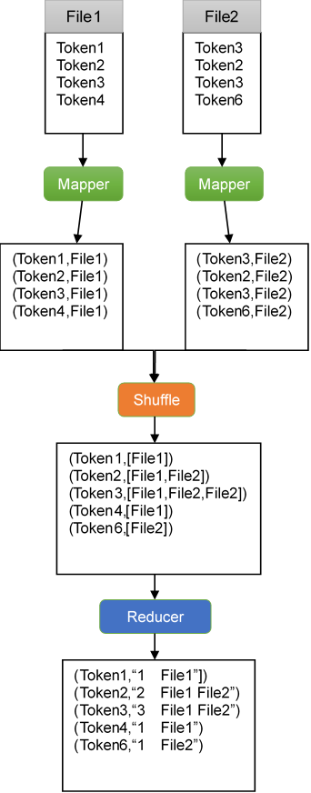

# WordCount Application
## Problem Statement
Given a set of text documents (i.e. text files) in input, create an index with the list of ngrams (e.g. bigrams) contained in these documents along with the number of times the ngrams were found across all documents and the list of files where the ngrams appear.

##Input
The list of files is provided in a directory (you can have an arbitrary number of files and file names), for example:
```
└── input
    ├── file01.txt
    ├── file02.txt
    ├── file03.txt
    └── ...
```

## Output
The output consists in a file that contains the list of ngrams (e.g. bigrams) identified in the documents in input, along with the number of times the ngram was found across all documents and the list of files where the ngrams where found. For example:
```
a collection	1 file01.txt
a network		1 file01.txt
a part			1 file03.txt
hadoop is 		2 file01.txt file03.txt
...
```

## Program Arguments

args[0]: The value N for the ngram. For example, if the user is interested only in bigrams, then args[0]=2.

args[1]: The minimum count for an ngram to be included in the output
file. For example, if the user is interested only in ngrams that appear at least 10 times across the whole set of documents, then args[1]=10.

args[2]: The directory containing the files in input. For example, args[2]=”/tmp/input/”

args[3]: The directory where the output file will be stored. For example, args[3]=”/tmp/output/”

In the example above, the bigram `hadoop is` was found 2 times in total, and it was found in files `file01.txt` and `file03.txt`.

## Solution
There are three method for solution the problem. Main method, in Assignment class, handle the arguments, configure job and store the program arguments into configuration object. Map method, in TokenizerMapper nested class, art mapper via producing key-value pair in witch token as key and filename as value. Reduce method, in IntSumReducer nested class, will handle the output of mapper and count the number of times the file name appears.



1. The main method handle each file in the path and make the content into token array.
2. Mapper produce the key-value pair <TOKEN, FILENAME>. In the output, there might appear duplicate key-value pair.
3. After the process of shuffle function, the value become the array which contain filename.
4. Reducer function will count the length of array and remove the duplicate filename.


